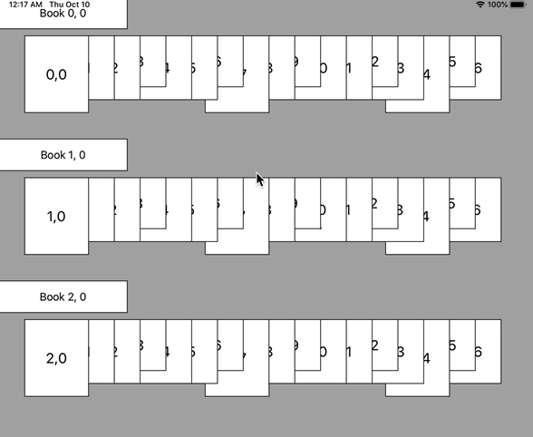

# PageCollectionView
Collection view controller, view, and layouts for pinching from book view, to page grid, to full screen page.

This is a simple CollectionViewController, CollectionView, and related Layouts to navigate around collections of pages.
The top-level layout is the Shelf, where collections of pages are grouped into rows. After selecting a row, that row
fans out into a grid view. Last, when a page is selected, the pages zoom to full screen.

Navigating back out be either pulling at the top of the list, or by pinching back into the previous layout

Example:

This is a UICollectionView based layout based on [Loose Leaf(https://getlooseleaf.com) app. Loose Leaf's navigation
has a number of other feature's I'd like to eventually implement here as well. When I built Loose Leaf originally,
UICollectionViews didn't exist yet (ack!), so it's been a lot of fun rebuilding some of the interactions with much
simpler and cleaner code!

